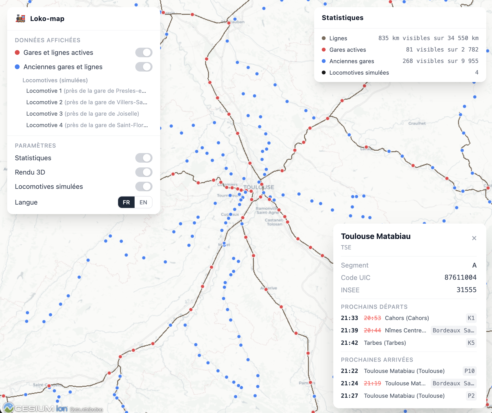
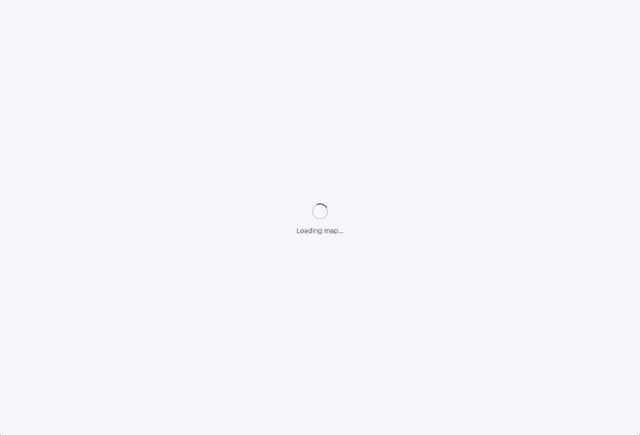
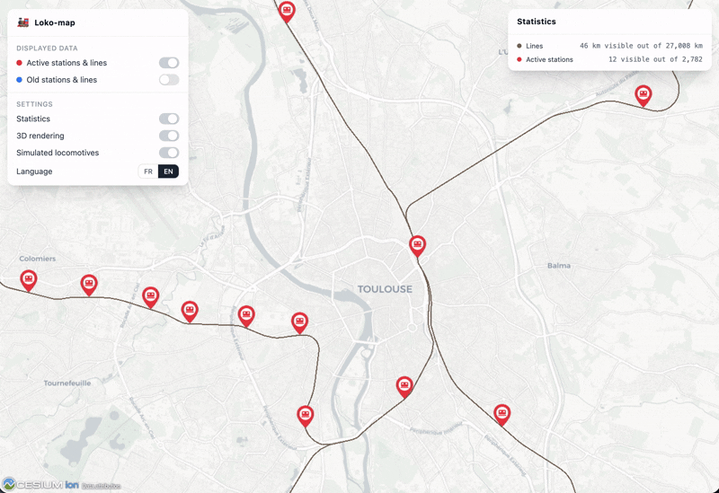

# loko-map

**loko-map** is a web application developed to visualize French railway network on an interactive 3D globe.

It's made with love with React and CesiumJS (and a lot of other things).

The ultimate goal was to create a real-time visualization of the approximate locations of trains in France. However, this still required a lot of work and also required paying for access to the SNCF APIs due to the number of requests needed. So I gave up!



## Features

### Default view

Display of the globe focused on France with display of all the train stations and train lines currently in service.

The top-left panel is for displayed data and settings. You can :

- Enable/disable the active station and lines
- Enable/disable the old station and lines
- Enable/disable the statistics panel
- Enable/disable the 3D rendering
- Enable/disable the simulated locomotives
- Switch language between English and French

The top-right panel is about statistics. It will update depending of the user view and depending of the settings. You can see :

- Lines with number of visible lines and total number
- Active stations with number of visible stations and total number
- Former (yes it was old above I know) stations with number of visible stations and total number
- Number of simulated locomotives



### Train station popup

You can click on an active station to get information about it. It's a mix of data from processed geojson (Name, segment, UIC code, INSEE) and from SNCF API (Next departures and next arrivals).



### Show active stations and lines

Enable by default. It's all the active stations and lines in France.

Data are coming from geojson served by the back-end and which is processed data coming from SNCF API. I filtered not used data and used algorithms to correct the position of a lot of train stations which were not exactly on the tracks.


### Old stations and lines + 3D display of rails and simulated locomotives

Disable by default. It's all the old (so not used, demolished...) stations and lines.

I used data from Robert Jeansoulin (see Attributions) who processed all the old train stations in France (it's a very nice job) and I also did a geojson which is processed data from SNCF API. But the SNCF doesn't have a lot of information about old tracks so I've nearly no tracks and nearly all old stations.

You can click on one of the 4 simulated locomotive to focus on it. It will display 3D rails with a locomotive moving and the camera will (sometimes) follow the train.

The locomotive is a glb file model but the rails are just 3D geometry with CesiumJS due to performance issues to use a true glb file for every 5 meters of rails.


## Prerequisites

- node 22
- pnpm 10
- docker (for deployment)
- A [Cesium ion](https://cesium.com/ion/) access token
- A [SNCF open data](https://www.digital.sncf.com/startup/api) API token

## Development

```
git clone https://github.com/Gyskard/loko-map
cd loko-map
```

Create a `.env` file at the root:

```
VITE_CESIUM_TOKEN=your_cesium_token
SNCF_TOKEN=your_sncf_token
```

Then install dependencies and start all services:

```
pnpm install
pnpm dev
```

The web app is available at `http://localhost:5173` and the API at `http://localhost:3001`.

## Deployment (Docker)

```
docker build --build-arg VITE_CESIUM_TOKEN=your_cesium_token -t loko-map .
docker run -e SNCF_TOKEN=your_sncf_token -p 3001:3001 loko-map
```

## Tests

### Unit tests (93)

```
pnpm test
```

### End-to-end tests (8)

```
pnpm --filter @loko-map/web exec playwright install chromium
pnpm test:e2e
```

### Code quality

```
pnpm lint
pnpm typecheck
```

## Built With

- React 19
- CesiumJS / Resium
- Tailwind CSS
- Vite
- TypeScript
- Fastify
- Node.js
- Turborepo
- Pnpm
- Docker

## Authors

- **Thomas Margueritat** - _Initial work_ - [Gyskard](https://github.com/Gyskard)

## Attributions

- [© OpenStreetMap contributors](http://www.openstreetmap.org/copyright)
- [© OpenMapTiles](http://openmaptiles.org/)
- [© CARTO](https://carto.com)
- [© SNCF – Open Data SNCF API](https://numerique.sncf.com/startup/api/)
- [© Huwise](https://www.huwise.com/)
- [(ODbL 1.0) Datasets in Data.gouv](https://www.data.gouv.fr/datasets/un-siecle-de-gares-du-reseau-ferroviaire-francais-en-service-fermees-ou-disparues) by [Robert Jeansoulin](https://www.data.gouv.fr/users/robert-jeansoulin)

## License

This project is licensed under the GNU Version 3 - see the [LICENSE](LICENSE) file for details.
